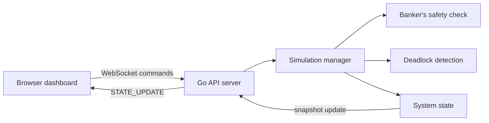

# deadlockd

`deadlockd` is a deadlock simulation toolkit built with Go and Next.js. It lets you load known process and resource states, watch the wait graph update in real time, test safe and unsafe requests, and inspect the system through a browser dashboard.

## What you can do

- Load named scenarios such as `CIRCULAR_WAIT`, `SAFE_STATE`, and `HOLD_AND_WAIT`
- Start and stop the simulator from the dashboard
- Send manual resource requests through the sandbox panel
- See allocation and need matrices update live
- Inspect deadlock status, safe sequences, and timing metrics
- Run the full stack with Docker Compose or run backend and frontend separately

## Stack

- Backend: Go 1.23, goroutines, WebSocket streaming
- Frontend: Next.js 16, React 19, Tailwind CSS, React Flow
- Runtime: Docker Compose

## Quick start

### Docker

```bash
docker-compose up --build
```

Open:

- Frontend: `http://localhost:3000`
- Backend: `http://localhost:8080`
- WebSocket: `ws://localhost:8080/ws`

### Local development

Backend:

```bash
cd backend
go run .
```

Frontend:

```bash
cd frontend
npm install
npm run dev
```

## Runtime flow



## Demo assets

- Demo video: [docs/demo/deadlockd-demo.webm](docs/demo/deadlockd-demo.webm)
- Home dashboard: [docs/screenshots/home.png](docs/screenshots/home.png)
- Running simulation: [docs/screenshots/running.png](docs/screenshots/running.png)
- Safe state scenario: [docs/screenshots/safe-state.png](docs/screenshots/safe-state.png)
- Manual request flow: [docs/screenshots/manual-request-success.png](docs/screenshots/manual-request-success.png)

## Repo layout

```text
backend/   Go simulation engine and WebSocket API
frontend/  Next.js dashboard
docs/      Screenshots, demo video, and diagrams
```

## Verification

These checks pass in this repo:

```bash
cd backend && go test ./... && go build ./...
cd frontend && npm run lint && npm run build
docker-compose up --build
```

## Notes

- The dashboard now sends an initial snapshot as soon as the WebSocket connects.
- Built-in scenarios now load real allocations, not just max claims, so the named states match what you see on screen.
- The frontend layout now stacks cleanly on narrow screens instead of overlapping cards and tables.
