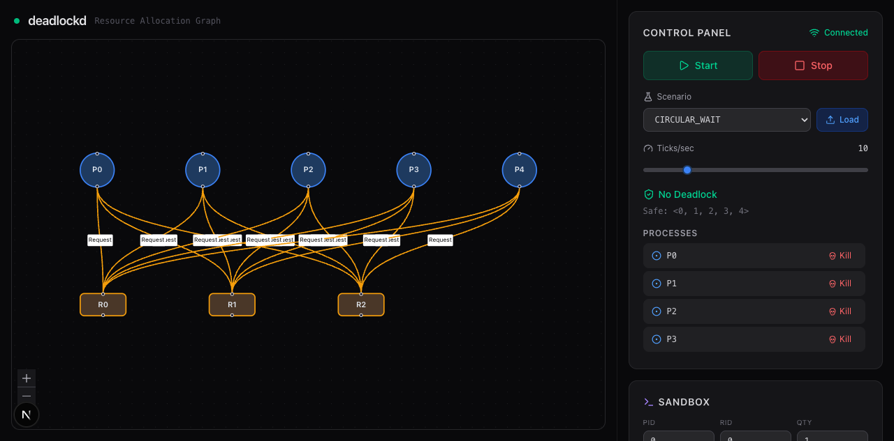
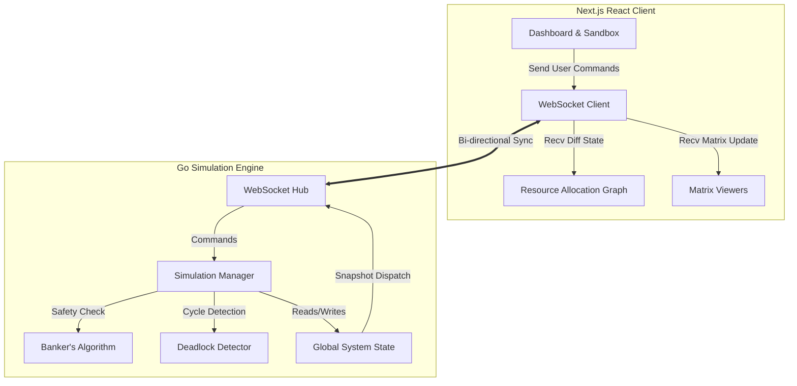
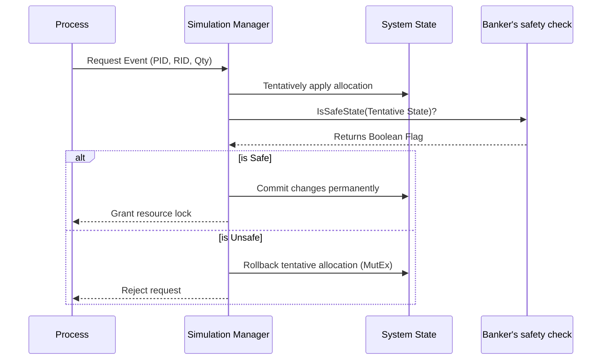
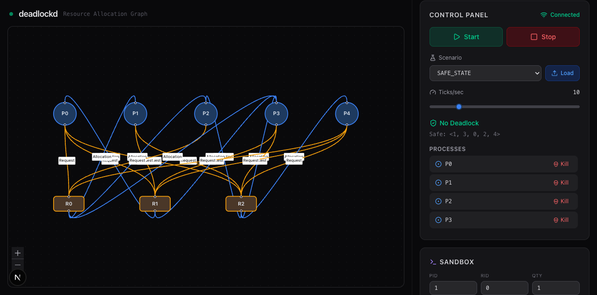

<div align="center">
  
  <br/>
  <h1>⛓️ deadlockd ⛓️</h1>
  <p><strong>A high-performance Deadlock Simulation Toolkit and Concurrency Visualizer</strong></p>
  <p>
    <a href="https://deadlockd-six.vercel.app"><strong>🚀 Live Demo</strong></a> •
    <a href="https://github.com/sagartailor-star/deadlockd"><strong>📦 Source Code</strong></a>
  </p>
</div>


[Live Demo](https://deadlockd.vercel.app)

`deadlockd` is a real-time deadlock simulation framework architected with a heavily concurrent **Go backend** and a reactive **Next.js frontend**. Built for systems engineers, educators, and CS students, it visualizes resource contention, validates state safety using **Banker's Algorithm**, and detects cyclic dependencies live through a dynamic WebSocket bridge.

---

## 🏗 System Architecture

The overarching design leverages a robust separation of concerns, offloading all heavy graph detection computations to the Go engine while pushing 60fps React topological graph updates to the browser.



## 🧠 Core Engine Integrity: Banker's Algorithm

Whenever a manual or automated resource request is dispatched by a Process, it is intercepted and evaluated strictly against the constraint model using the Banker's Algorithm to guarantee system safety.



---

## 📸 Platform Demos & Highlights

### Interactive Sandbox & Deadlock Cycles

*Granular control over resources enables active evaluation of unsafe state cascading.*

### Live Simulation Recording
> Explore the 60fps unthrottled WebSockets pushing delta-graph variations.
>
> <video src="docs/demo/deadlockd-demo.webm" width="100%" controls autoplay loop muted></video>
> *(Make sure to click Play if it doesn't autoplay! Default playback demonstrates simulated circular wait graphs)*

---

## 🚀 Quick Start Guide

### 🐳 Docker Compose (Recommended)
Bootstraps both the Go WebSocket engine and the Next.js static renderer immediately.
```bash
docker-compose up --build
```

**Access Endpoints:**
- 🖥️ **Frontend UI**: `http://localhost:3000`
- ⚙️ **Backend API**: `http://localhost:8080`

### 💻 Local Source Verification
Built for transparency. Both backend and frontend follow strict standard library + modern tooling implementations.

**Backend (Go Engine)**
```bash
cd backend
go test ./...    # Validate concurrent simulations pass
go run .         # Start WebSocket daemon
```

**Frontend (Next.js)**
```bash
cd frontend
npm install      # Requires Node 18+
npm run lint     # Strict TS validation
npm run dev      # Spin up Hot-Reloading server
```

---

## 🔬 Design Notes & Constraints
- **Concurrency Strategy**: The Go engine utilizes bounded goroutines mapping 1:1 with simulated OS Processes. The `SystemState` strictly synchronizes operations relying on pointer matrix allocations protected by `sync.Mutex`. Time starvation is prevented by short-running lock critical sections.
- **WebSocket Streaming**: React state operates independently of UI repaint operations using `@xyflow/react` to optimize memoized updates across massive unthrottled node deployments.

