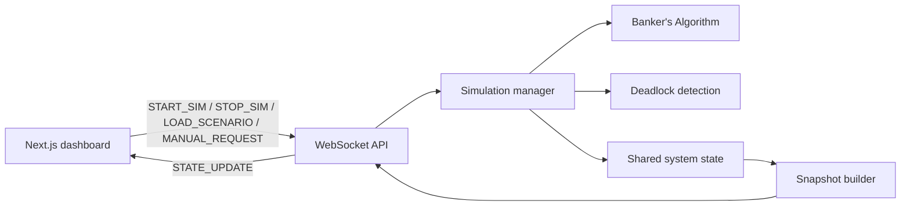

# Runtime Flow

```mermaid
flowchart LR
  UI["Next.js dashboard"] -->|"START_SIM / STOP_SIM / LOAD_SCENARIO / MANUAL_REQUEST"| API["WebSocket API"]
  API --> SIM["Simulation manager"]
  SIM --> BANKER["Banker's Algorithm"]
  SIM --> DETECT["Deadlock detection"]
  SIM --> STATE["Shared system state"]
  STATE --> SNAP["Snapshot builder"]
  SNAP --> API
  API -->|"STATE_UPDATE"| UI
```
